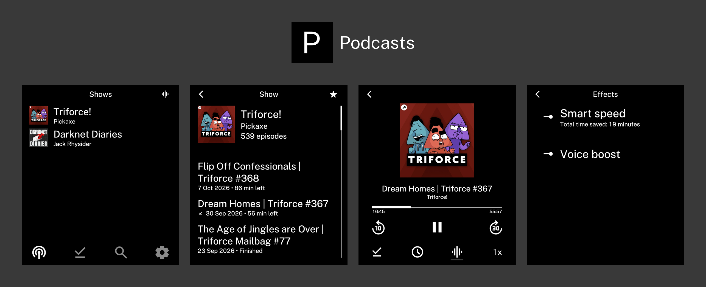

A podcast player for Light Phone III, built with Ink.

  <a href="https://github.com/No-Scrolling/podcasts?tab=readme-ov-file#license"><picture><source media="(prefers-color-scheme: dark)" srcset="https://img.shields.io/github/license/No-Scrolling/podcasts?label=licence&amp;color=e5e5e5&amp;labelColor=5c5c5c"><source media="(prefers-color-scheme: light)" srcset="https://img.shields.io/github/license/No-Scrolling/podcasts?label=licence&amp;color=black"></picture></a>
  <a href="https://github.com/No-Scrolling/podcasts/releases"><picture><source media="(prefers-color-scheme: dark)" srcset="https://img.shields.io/github/v/release/No-Scrolling/podcasts?include_prereleases&amp;sort=date&amp;label=release&amp;color=e5e5e5&amp;labelColor=5c5c5c"><source media="(prefers-color-scheme: light)" srcset="https://img.shields.io/github/v/release/No-Scrolling/podcasts?include_prereleases&amp;sort=date&amp;label=release&amp;color=black"></picture></a>

## Installation

The latest APK is available in [Releases](https://github.com/No-Scrolling/podcasts/releases/latest).

## Features

- Search shows through Apple Podcasts and star your favourites.
- Adjust playback speed.
- Shorten pauses with Smart Speed and balance speech volume with Voice Boost.
- Read episode descriptions and tap timestamps to jump ahead.
- Set a sleep timer for a duration or the end of an episode.
- Delete downloads manually or automatically after listening.
